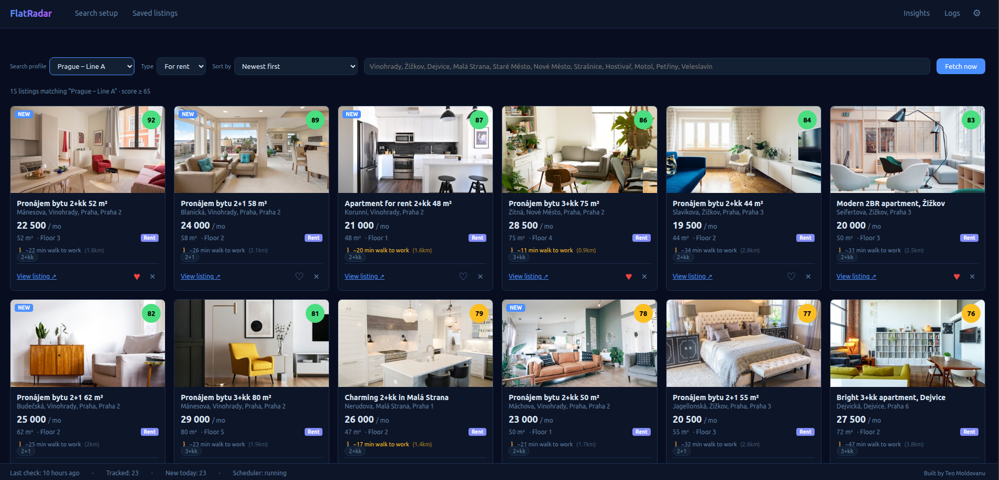

# FlatRadar

A personal apartment search tool for the Czech Republic. Aggregates listings from Sreality, Bezrealitky, and Expats.cz into one place, scores them against your criteria, and emails you when new matches appear.

Built for English-speaking expats searching for apartments in Czech Republic.

**Free and open-source.** MIT license. Built by [Teo Moldovanu](https://teokitten.github.io).

**[→ Live demo](https://teokitten.github.io/flatradar)**

---



---

## What it does

Most apartment search tools in Czech Republic are single-source, Czech-only, and offer basic email alerts at best. FlatRadar pulls listings from three sources at once, removes duplicates, and ranks results based on how well they match what you're looking for.

- **Aggregates** Sreality, Bezrealitky, and Expats.cz in one feed
- **Scores** each listing 0–100 against your criteria
- **Filters** by city, district, neighborhood, metro stop, price, size, room type, furnishing, building condition, and specific features such as balcony, parking, cellar, bathtub, and dishwasher
- **Shows proximity** to supermarkets and parks when you set up a search
- **Calculates commute time** to your workplace for listings with GPS data
- **Saves and tracks** listings you're interested in – add notes, update status, export to CSV
- **Tracks the market** – price changes, best days new listings appear, average price per m² by district, time on market, and how well your criteria match current supply
- **Emails you** when new matching listings appear – only when there's something new

---

## Requirements

- Python 3.10 or higher
- macOS, Linux, or Windows
- Any modern browser (Chrome, Firefox, Edge, Safari – Chrome recommended)
- Internet connection
- A Yahoo, Gmail, Outlook, or iCloud account for email notifications

---

## Installation

```bash
git clone https://github.com/teokitten/flatradar.git
cd flatradar
python3 -m venv venv
./venv/bin/pip install -r requirements.txt
./venv/bin/python app.py
```

Open [http://localhost:5001](http://localhost:5001) in your browser.

To keep the app running after closing the terminal:

```bash
nohup ./venv/bin/python app.py > flatradar.log 2>&1 &
```

---

## Setup

**1. Create a search profile**

Go to **Search setup**. Choose your city or district, set a price range and size, pick room types and any features you need. Save the profile.

You can create multiple profiles, for example based on different cities or requests.

**2. Set up email notifications**

Go to **App Settings** (⚙). Choose your email provider from the dropdown – setup instructions appear automatically. You'll need an app password, not your regular account password. The form explains how to get one for each provider.

**3. Run a fetch**

Click **Fetch now** in the feed, or wait for the scheduler. The default interval is 15 minutes. The first run populates your database; subsequent runs find what's new.

---

## Limitations

**Sreality photos do not load.** Sreality's CDN blocks image requests from outside their site. Listing data and links work correctly – only photos are missing. Bezrealitky and Expats.cz images load fine.

**The app must be running to check for listings.** FlatRadar runs locally on your machine. If the app is stopped, no fetches happen and no notifications are sent.

**GPS data is partial.** Bezrealitky provides coordinates. Sreality and Expats.cz do not. Commute time and proximity features only work for listings that have GPS data (~30% of the total).

**Feature extraction is best-effort.** Furnished status, balcony, parking, and similar details are parsed from listing labels. Not all listings include them, and accuracy depends on how thoroughly the landlord filled in their listing.

**Supermarket and park data comes from OpenStreetMap** via the public Overpass API, which has rate limits. If you select many areas quickly, some requests may be delayed and retried on the next load.

---

## Data sources

| Source | Used for |
|---|---|
| [Sreality.cz](https://www.sreality.cz) | Listing data and links (no images) |
| [Bezrealitky.cz](https://www.bezrealitky.cz) | Listing data, images, GPS |
| [Expats.cz](https://www.expats.cz) | English-language listings, images |
| [OpenStreetMap](https://www.openstreetmap.org) via Overpass | Supermarket and park locations |
| [Nominatim](https://nominatim.org) | Workplace address geocoding |
| [OSRM](https://project-osrm.org) | Walking route times |

---

## Stack

Flask · SQLite · APScheduler · vanilla JavaScript · Chart.js

---

## License

MIT License – see [LICENSE](LICENSE) for details.

---

Built by [Teo Moldovanu](https://teokitten.github.io)
